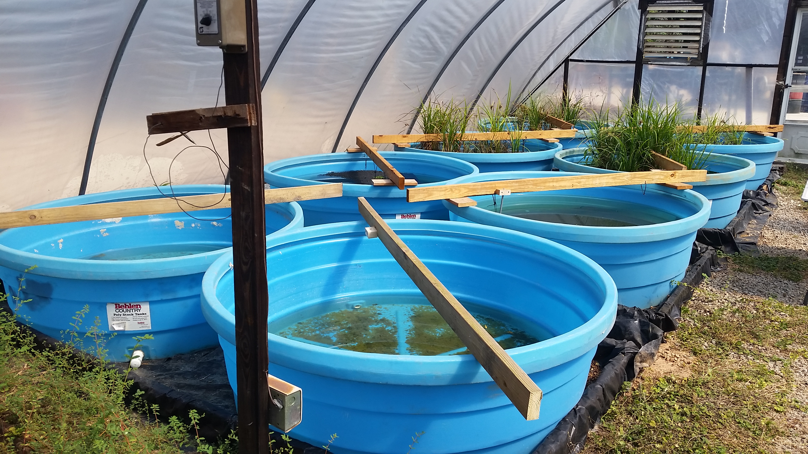

```{r, setup_handbook, include=FALSE}
#----------------------------------------
# to reload R file in case updating
#----------------------------------------
# https://www.pharmasug.org/proceedings/china2018/AD/Pharmasug-China-2018-AD38.pdf
#@ https://community.rstudio.com/t/best-practices-for-organizing-rmarkdown-projects/914/2
# http://www.dartistics.com/rmarkdown-shiny.html
#@ http://dannyjnwong.github.io/blog/

# a bookdown template that works perfectly!  07-28-2019
# https://francoisbirgand.github.io/template-bookdown-article.html

# https://adv-r.hadley.nz/evaluation.html


#HOME <- paste0(getwd(), "/")
HOME = paste0(normalizePath("."), "/")
source("./global.R")

options(digits = 4)


# I found this function that loads a list of packages using 'library', and installs them if they are not installed. 
ipak <- function(pkg){
    new.pkg <- pkg[!(pkg %in% installed.packages()[, "Package"])]
    if (length(new.pkg)) 
        install.packages(new.pkg, dependencies = TRUE)
    sapply(pkg, library, character.only = TRUE)
}

# usage
# packages <- c("knitr", "captioner", "stringr", "devtools", "bookdown","kableExtra")
# ipak(packages)
 
file.lst <- list_files_in_a_folder(folder.loc=paste0(HOME, "/util/"), file.extension=c(".r", ".R"))
for (ifile in 1:length(file.lst)) {source(file=file.lst[ifile]) }     

file.lst <- list_files_in_a_folder(folder.loc=paste0(HOME, "/module/"), file.extension=c(".r", ".R"))
for (ifile in 1:length(file.lst)) {source(file=file.lst[ifile])  }     
 
file.lst <- list_files_in_a_folder(folder.loc=paste0(HOME, "/script/"), file.extension=c(".r", ".R"))
for (ifile in 1:length(file.lst)) {source(file=file.lst[ifile])  }     

```


 
 
```{r}
ALL <- reactiveValues(
  DATA   = default_DATA, 
  FIGURE = default_FIGURE, 
  TABLE = default_TABLE, 
  cppModel = default_cppModel, 
  ctlModel = default_ctlModel, 
  script = default_script
)  
```


```{r eval=FALSE}
rmd <- list.files(pattern = '*.Rmd', recursive = T)
chunks <- paste0("```{r child = './", rmd, "'}\n```\n")
cat(chunks, sep = '\n')
```
 

```{r child = './rmd/01_preface/01_preface.Rmd'}
```

```{r child = './rmd/02_construct_dataset/01_construct_dataset.Rmd'}
```

```{r child = './rmd/03_integrity_check/01_load_data.Rmd'}
```

```{r child = './rmd/03_integrity_check/02_quick_check.Rmd'}
```

```{r child = './rmd/03_integrity_check/03_advanced_check.Rmd'}
```

```{r child = './rmd/03_integrity_check/04_buildIn_model.Rmd'}
```

```{r child = './rmd/04_summary_dataset/01_summary_dataset.Rmd'}
```

```{r child = './rmd/05_descriptive_analysis/01_stdtimeprofile.Rmd'}
```

```{r child = './rmd/05_descriptive_analysis/02_pkpd_relationship.Rmd'}
```

```{r child = './rmd/05_descriptive_analysis/03_NCA_analysis.Rmd'}
```

```{r child = './rmd/06_run_ctl/01_run_nonmem_model.Rmd'}
```

```{r child = './rmd/06_run_ctl/02_model_diagnostic.Rmd'}
```

```{r child = './rmd/07_run_cpp/01_run_sim.Rmd'}
```

```{r child = './rmd/08_exposure_response/01_exposure_response.Rmd'}
```

```{r child = './rmd/09_advanced_model/01_advanced_model.Rmd'}
```

```{r child = './rmd/10_reporting/01_reporting.Rmd'}
```

```{r child = './rmd/90_appendix/01_global_setting.Rmd'}
```

```{r child = './rmd/90_appendix/01_model_library.Rmd'}
```

```{r child = './rmd/90_appendix/02_dplyr.Rmd'}
```

```{r child = './rmd/90_appendix/03_ggplot.Rmd'}
```

```{r child = './rmd/90_appendix/04_mrgsolve.Rmd'}
```

```{r child = './rmd/90_appendix/05_tools.Rmd'}
```
 

```{r child = './rmd/references.Rmd'}
```


 
```{r setup99, include=FALSE}
knitr::opts_chunk$set(echo = TRUE)
```

This R Markdown document is made interactive using Shiny. Unlike the more traditional workflow of creating static reports, you can now create documents that allow your readers to change the assumptions underlying your analysis and see the results immediately. 

To learn more, see [Interactive Documents](http://rmarkdown.rstudio.com/authoring_shiny.html).

## Inputs and Outputs

You can embed Shiny inputs and outputs in your document. Outputs are automatically updated whenever inputs change.  This demonstrates how a standard R plot can be made interactive by wrapping it in the Shiny `renderPlot` function. The `selectInput` and `sliderInput` functions create the input widgets used to drive the plot.

```{r eruptions, echo=FALSE}
inputPanel(
  selectInput("n_breaks", label = "Number of bins:",
              choices = c(10, 20, 35, 50), selected = 20),
  
  sliderInput("bw_adjust", label = "Bandwidth adjustment:",
              min = 0.2, max = 2, value = 1, step = 0.2)
)

renderPlot({
  hist(faithful$eruptions, probability = TRUE, breaks = as.numeric(input$n_breaks),
       xlab = "Duration (minutes)", main = "Geyser eruption duration")
  
  dens <- density(faithful$eruptions, adjust = input$bw_adjust)
  lines(dens, col = "blue")
})
```

## Embedded Application

It's also possible to embed an entire Shiny application within an R Markdown document using the `shinyAppDir` function. This example embeds a Shiny application located in another directory:

```{r tabsets, echo=FALSE}
shinyAppDir(
  system.file("examples/06_tabsets", package = "shiny"),
  options = list(
    width = "100%", height = 550
  )
)
```

Note the use of the `height` parameter to determine how much vertical space the embedded application should occupy.

You can also use the `shinyApp` function to define an application inline rather then in an external directory.

In all of R code chunks above the `echo = FALSE` attribute is used. This is to prevent the R code within the chunk from rendering in the document alongside the Shiny components.


http://discuss.go-isop.org/t/building-pharmacometric-applications-using-r-an-online-r-shiny-tutorial/57


https://www.page-meeting.org/pdf_assets/7336-PAGE%20Poster%20PopkinR%20-%20Final%20version.pdf


http://go-isop.org/isop-shiny-server/

http://webpopix.org/shiny/ShinyExamples.html

Application of ggplot2 to Pharmacometric Graphics
https://ascpt.onlinelibrary.wiley.com/doi/full/10.1038/psp.2013.56
 
https://www.go-acop.org/assets/Legacy_ACOPs/ACOP8/Abstracts/M-011.pdf


# sas pdf shiny
https://www.go-acop.org/assets/Legacy_ACOPs/ACOP8/Abstracts/M-034.pdf

https://www.go-acop.org/assets/Legacy_ACOPs/ACOP8/Abstracts/M-060.pdf


Systems Pharmacology Modeling in R, powered by Shiny 
https://www.go-acop.org/assets/Legacy_ACOPs/ACOP8/Abstracts/M-097.pdf


https://www.go-acop.org/previous-acop-meetings-acop8-posters

# a company
https://www.qpharmetra.com/company/pharmacometrics/

IntiQuan GmbH – Unlocking the power of data for better decision making
https://www.intiquan.com/


Interactive Pharmacometric Applications Using R and the Shiny Package
https://www.ncbi.nlm.nih.gov/pmc/articles/PMC4394611/


## Introduction {#intro}

You can label chapter and section titles using `{#label}` after them, e.g., we can reference Chapter \@ref(intro). If you do not manually label them, there will be automatic labels anyway, e.g., Chapter \@ref(methods).

Figures and tables with captions will be placed in `figure` and `table` environments, respectively.

```{r pressureplot,  fig.cap='Inteactive histogram plot!'}
plotOutput("pressureplot")

```

 

```{r nice-fig, context="server", fig.cap='Here is a nice figure!', fig.align='center', tidy=FALSE}
output$pressureplot <- renderPlot({
 #out.width='80%', fig.asp=.75,
par(mar = c(4, 4, .1, .1))
plot(pressure, type = 'b', pch = 19)
})

```

Reference a figure by its code chunk label with the `fig:` prefix, e.g., see Figure \@ref(fig:nice-fig). Similarly, you can reference tables generated from `knitr::kable()`, e.g., see Table \@ref(tab:nice-tab).

```{r nice-tab, tidy=FALSE}
knitr::kable(
  head(iris, 20), caption = 'Here is a nice table!',
  booktabs = TRUE
)
```

You can write citations, too. For example, we are using the **bookdown** package [@R-bookdown] in this sample book, which was built on top of R Markdown and **knitr** [@xie2015].   [@R-shiny].

## Shiny

Here is a review of existing methods.
 

```{r data, include=FALSE}
library(dplyr)
faithful_data <- sample_n(faithful, 100)
```
 

```{r}
selectInput("n_breaks", label = "Number of bins:",
            choices = c(10, 20, 35, 50), selected = 20)

sliderInput("bw_adjust", label = "Bandwidth adjustment:",
            min = 0.2, max = 2, value = 1, step = 0.2)
```
 

### Geyser Eruption Duration

```{r histogram_plot,  fig.cap='Inteactive histogram plot!'}
plotOutput("eruptions")
```

```{r, context="server"}
output$eruptions <- renderPlot({
  hist(faithful_data$eruptions, probability = TRUE,
       breaks = as.numeric(input$n_breaks),
       xlab = "Duration (minutes)", main = "Geyser Eruption Duration")

  dens <- density(faithful_data$eruptions, adjust = input$bw_adjust)
  lines(dens, col = "blue")
})
```


```{r}
# This is template that shows some of the main features offered by R Markdown to write a

```

```{r setup, include=FALSE}  
# this chunck sets up some of the common setting for all the document later on.
# The first line below sets the figure default sizes, figures will be aligned, that the R code does not appear (echo=FALSE), and that the 
# warning messages should not show up
# https://francoisbirgand.github.io/template-bookdown-article.html
knitr::opts_chunk$set(fig.height=5, fig.width=9, fig.align="center", echo = FALSE, warning=FALSE)


```

```{r}
rmarkdown::default_output_format(knitr::current_input())$name
```

```{r, eval=FALSE}
library(extrafont); library(ggplot2)
#font_import() only do this one time - it takes a while
loadfonts(device = "win")
windowsFonts(Times = windowsFont("TT Times New Roman"))

theme_set(theme_bw(base_size=12,base_family='Times New Roman')+
             theme(panel.grid.major = element_blank(), 
                   panel.grid.minor = element_blank()))

# ggplot
# https://ben-williams.github.io/updated_ggplot_figures.html

# https://stackoverflow.com/questions/20596902/r-avoiding-restarting-interrupted-promise-evaluation-warning
#https://github.com/adam-p/markdown-here/wiki/Markdown-Cheatsheet
 
#----------------------------------------
# to create the list of resource_files
#----------------------------------------
source("./global.R")
HOME <- paste0(".") 

file.lst = NULL
file.lst <- c(file.lst, list_files_in_a_folder(folder.loc=paste0(HOME, "/rmd/"), file.extension=c(".Rmd")))
file.lst <- c(file.lst, list_files_in_a_folder(folder.loc=paste0(HOME, "/module/"), file.extension=c(".r", ".R")))
file.lst <- c(file.lst, list_files_in_a_folder(folder.loc=paste0(HOME, "/script/"), file.extension=c(".r", ".R")))
file.lst <- c(file.lst, list_files_in_a_folder(folder.loc=paste0(HOME, "/data/"), file.extension=c(".csv")))
file.lst <- c(file.lst, list_files_in_a_folder(folder.loc=paste0(HOME, "/ctl/"), file.extension=c(".ctl")))
file.lst <- c(file.lst, list_files_in_a_folder(folder.loc=paste0(HOME, "/cpp/"), file.extension=c(".cpp")))
file.lst <- c(file.lst, list_files_in_a_folder(folder.loc=paste0(HOME, "/lib/"), file.extension=c(".xlsx", "pptx", "docx")))
file.lst <- c(file.lst, list_files_in_a_folder(folder.loc=paste0(HOME, "/util/"), file.extension=c(".r", ".R")))

# find a string multiple files
if (1==2) { 
    for (ifile in 1:length(file.lst)) {
     print(file.lst[ifile])
     txt = paste0(readLines(file.lst[ifile]), collapse=" ")
     if ( length(grep("within standard_dataset_container", txt, fixed=TRUE) )) {        #  reshape sm
       print(file.lst[ifile])
       print("found one")
       
       exit;
     }
    }
}
 
file.lst <- gsub("./", " - ", file.lst, fix=TRUE)
file.lst <- gsub("//", "/", file.lst, fix=TRUE)
file.lst <- paste0(file.lst, collapse = "\n")

write_csv(data.frame(file.lst), path="tmp.txt")
 

```


# Template goals

The goal of this template is to show how to write an article in R Markdown. There are many advantages for using R Markdown: it is an integrated way to put together text, codes for figures, figure labels, tables, and references. Actually the template I am showing here, is not *strictly sensu* `R Markdown` but another package, which is called [`bookdown`](https://bookdown.org/yihui/bookdown/). `bookdown` is based on R markdown, but has some really great features about cross-references, which I find to be better than R Markdown proper. Additionally, papers written individually can eventually be assembled into a book with all the cross references done automatically. 

The first thing you need to do is to read the [R Markdown crash course](https://francoisbirgand.github.io/RMarkdown_instructions.html) I have written, as it will give you lots information very useful to understand what is happening in this template. The second thing you need to do is to take this **TemplateArticleBookdown.Rmd** document and try to `knit` it using the button that has whool and the 'Knit' word next to it in the R Studio window. Normally, all the functionalities should work, so you should be able to have the document appear directly. In the end it is the **TemplateArticleBookdown.Rmd** file that is important because you have access to all the code, regardless of the output.

So by now, you probably realize that the main features are the YAML header, the text and its associated *markup* alteration, and the code chunks. An additional important feature is equations, which are written a bit differently in `bookdown`, than in `R Markdown`. There is a paragraph just for this below.

# Input File locations

I think it is best to create a project directory where all the necessary files are going to be needed. In this directory, you should have 

- a project file in R Studio *.Rproj
- the *.Rmd files you are using
- the *.csl file you will need to define the formatting of the bibliography references
- the *.bibtex file in which the references of your articles are located (see example with this template)
- possibly a directory where you will store the pictures files
- all your *.csv files where you might have your data for plotting, but also csv files corresponding to info to be added in tables
- a template document for word (e.g., template.docx) if you want to use one. I have added one in the directory for references. 

# Output Files

The beauty of `R Markdown` and `bookdown` is that several outputs are possible. For most of what we do, html, pdf, and *.docs are good outputs. If you look in the YAML header, you will see three outputs like:

```
output: 
  bookdown::pdf_document2:
    toc: true
    number_sections: true
  bookdown::html_document2:
    toc: false
    number_sections: false
  bookdown::word_document2:
    reference_docx: template.docx
    fig_width: 4
    fig_height: 3
    fig_caption: true
```

This means that you can 'knit' your document either into pdf, html, or word. For this, instead of clicking on the 'knit' button, click on the bottom arrow just right of it, and you will be able to choose the option you want. The reason for the "2" in '*_document2' is because the `documentclass` is an article, and not a book. Had it been a book, there would be no "2" added here. There are lots of options that can be added for each document type but the ones above are probably good by default.  Go to Figure with Image at Section \@ref(discussion).

then go to sec-summaris-eexposure at \@ref(sec-summaris-eexposure). 


You can actually remove the options under, e.g., `bookdown::word_document2:` and add `bookdown::word_document2: null` and the default template document in word will be chosen by default.

Upon 'knitting' your document, several files will be created in your directory, including word, html and pdf documents. If you see some in the TemplateRMarkdownReport directory, it is because somebody has tried knitting and has already created some output files.

### Some default options in the YAML

In the YAML header of this document, in the `output` section description, you can see

```
output: 
  bookdown::html_document2:
    toc: true
    number_sections: false
```

This means the table of content (toc) will show up, but the numbering of the section will not. Changing values to `TRUE` or `FALSE` will able/enable each option


## Paragraph headers and numbering

For the different paragraph headers, use the number of necessary `#` to create as many subsections as needed. 

### Paragraph1

Your beautiful prose goes here

### Paragraph2
#### Subparagraph

Your beautiful prose goes here

```
### Paragraph1

Your beautiful prose goes here

### Paragraph2
#### Subparagraph

Your beautiful prose goes here
```


## Figures, captions and references

Below in Figure \@ref(fig:plot-example-data-fig1) you can see how a chunk is written and how some of the figure parameters are added.

```
Below in Figure \@ref(fig:plot-example-data-fig1) you can see how a chunk is written and how some of the figure parameters are added.
```

This is borrowed from another document so the figure in itself is not essential, but the code to express how the figure should be displayed is

```
{r "plot-example-data-fig1", eval=TRUE, echo=TRUE, out.width = '60%', fig.align = 'center', fig.cap="10-min instantaneous flow rates as a function of time "}
```

### Figures generated by R codes

The first item between "" is the name of the chunk, which serves as the reference for the figure. Try to find a simple name which describes well that figure. The current label is not particularly good. You should find a better one. If two chunks have the exact same name, R Studio will not knit and will give you an error message: each chunk must have its unique identifier name.

The other options are rather self explanatory in there. `fig.cap=` gives the exact caption of the figure you want.  Notice that the caption appears under the figure with an automatic number. You do not have to tweak it. It is automatic. The figure number is also automatically added in the text cross reference as in the `Figure \@ref(fig:plot-example-data-fig1)` code.

```{r "plot-example-data-fig1", eval=TRUE, echo=FALSE, out.width = '60%', fig.align = 'center', fig.cap="10-min instantaneous flow rates as a function of time "}

par(mar=c(4.5,4.5,0.5,0.5))
date<-as.POSIXlt(c("1999-01-18 07:00:00","1999-01-18 07:10:00","1999-01-18 07:20:00","1999-01-18 07:30:00",
                   "1999-01-18 07:40:00","1999-01-18 07:50:00","1999-01-18 08:00:00","1999-01-18 08:10:00",
                   "1999-01-18 08:20:00","1999-01-18 08:30:00","1999-01-18 08:40:00","1999-01-18 08:50:00",
                   "1999-01-18 09:00:00","1999-01-18 09:10:00","1999-01-18 09:20:00","1999-01-18 09:30:00",
                   "1999-01-18 09:40:00","1999-01-18 09:50:00","1999-01-18 10:00:00","1999-01-18 10:10:00",
                   "1999-01-18 10:20:00","1999-01-18 10:30:00","1999-01-18 10:40:00","1999-01-18 10:50:00",
                   "1999-01-18 11:00:00","1999-01-18 11:10:00","1999-01-18 11:20:00","1999-01-18 11:30:00",
                   "1999-01-18 11:40:00","1999-01-18 11:50:00","1999-01-18 12:00:00"))
Q<-c(76.7,81.5,85.9,91.4,98.6,112.7,116.3,120.3,124.7,128.7,133.6,137.9,142.2,147.1,152.3,158.3,163.0,
     168.8,174.0,179.6,184.7,190.2,196.0,200.3,205.2,209.3,213.4,217.4,221.2,225.0,229.2)
xlim=as.POSIXct(c(min(date),max(date)));ylim=c(min(Q),max(Q))
plot(date,Q,xlim=xlim,ylim=ylim)
```

 


In the Figure \@ref(fig:plot-example-data-fig1) example, it is an `R` code was actually run. But if you want to add a picture, you need to use something a bit different. you use the code and you get the results in Figure \@ref(fig:fig-pic)

```
r "fig-pic", echo=FALSE, out.width = '70%', fig.align = 'center', fig.cap="Eight floating island mesocosms *(FW~1~)* to *(FW~8~)*"}
knitr::include_graphics("pictures/Activation_energy.png")
```

```{r "fig-pic", echo=FALSE, out.width = '70%', fig.align = 'center', fig.cap="Eight floating island mesocosms *(FW~1~)* to *(FW~8~)*"}

```

Notice that it is possible to have some markup to the text in the figure caption. This works well for html and word output but not so for pdf output... I would stay away from markup in the figure captions as much as possible.

### Figures with multiple images

It is possible to have several images right next to each other. `fig.show = 'hold'` is new here, and this is what allows to plot several pictures together. `out.width = '25%'` also details the width of both images. Images are stuck next to each other however with this method... The only option I have found is to add a white strip of a white rectangle in PowerPoint to the left image... Not great but it works.

```
{r "fig-2pic", echo=FALSE, out.width = '25%', fig.show = 'hold', fig.align = 'center', fig.cap="A: Eight floating island mesocosms *(FW~1~)* to *(FW~8~)*, and B: details of cleanup efforts"}
knitr::include_graphics(c("pictures/mesocosms1.jpg","pictures/mesocosms2.jpg"))
```

This code, however, does not render in Word. I have thus inactivated the code so this document could be rendered in all three formats.

## Tables, caption, and references

For tables, there is a very cluncky way that is described in [R Markdown cheet sheet](https://www.rstudio.com/wp-content/uploads/2015/02/rmarkdown-cheatsheet.pdf). However, it is hardly satisfying. I believe it is a lot easier to use packages that already generate the markdown code for us. 

### Tables in html

The best package I have found right now is `kableExtra`. All the parameters and possibilities are described by the [kableExtra author Hao Zhu](https://haozhu233.github.io/kableExtra/awesome_table_in_html.html) and things are regularly updated.

The best way is to have the values for a table stored in a dataframe or in a .csv file, which is then read in first before `kableExtra` can represent it.

If you knitted to pdf or word, you will not see the table I am describing in html here. To produce Table \@ref(tab:RemovalTable1), I used the code below:

```{r "RemovalTable1", echo=FALSE, warning=FALSE, eval=FALSE}
RemovalTab1<-read.csv("table1.csv", header = TRUE)
fmt <- rmarkdown::default_output_format(knitr::current_input())$name #find the output format when knitting
if (fmt == "bookdown::html_document2"){
kableExtra::kable(RemovalTab1, align = "c", "html",
             caption = 'Removal values in three mescosms reports (fake values)',
             col.names = c("Reference","concentrations","type of water", "percentage removal")) %>%
      kable_styling(full_width = F) %>%
  column_spec(1, bold = T, border_right = T, width = "15em") %>%
  column_spec(2, width = "15em") %>%
  column_spec(3, width = "10em") %>%
  column_spec(4, width = "10em") %>%
  row_spec(1:4, background = "white")
}
```


```{r "RemovalTable2", echo=FALSE, warning=FALSE, eval=FALSE}
RemovalTab1<-read.csv("table1.csv", header = TRUE)
fmt <- rmarkdown::default_output_format(knitr::current_input())$name #find the output format when knitting
if (fmt == "bookdown::html_document2"){
kableExtra::kable(RemovalTab1, align = "c", "html",
             caption = 'Removal values in three mescosms reports (fake values)',
             col.names = c("Reference","NO~3~^-^ concentrations","type of water", "percentage removal")) %>%
      kableExtra::kable_styling(full_width = F) %>%
  column_spec(1, bold = T, border_right = T, width = "15em") %>%
  column_spec(2, width = "15em") %>%
  column_spec(3, width = "10em") %>%
  column_spec(4, width = "10em") %>%
  row_spec(1:4, background = "white")
}
```

The actual data stored in table1.csv is 

```
Reference,concentrations,type of water, percentage removal
@Borne2014-ek,0 to 30 mg/L,urban water, 35%
@Chang2013-cv,10 to 20 mg/L,Ag water, 3%
@De_Stefani2011-zt,0.9 to 2.3 mg/L,Forest water, 22%
@Khan2013-qr,0.3 to 0.79 mg/L,Ag water, 5%
```

I suggest you keep the header in your table such that you can remember what column is what. But it seems that you have to specify again the col.names in kable again. I do not seem to find a way around that...?

To reference the table in your text, use, similarly to figures, `Table \@ref(tab:RemovalTable1)` to write Table \@ref(tab:RemovalTable1).

OK, this works OK for html, but not so great with word or pdf outputs

### Tables in word

The best way to get tables in word is to actually render the document in html, copy and paste it directly into word. It works. It is not pretty but it does the job.

### Tables rendered in pdf

This is not as smooth for pdf. It turns out that as I was writing this tutorial, I just could not find a way to make `kableExtra` work here... So I spent a lot of time trying to find ways around it to make it work. If you are reading an html document, you will not see the table, only the code. The problem with `kableExtra`
is that, as far as I can tell, the markup text and reference citations are not rendered within the table... After reading quite a bit, I found that the package `pander` would work well, although it had one major drawback, which is that it would not allow the cross referencing by default... After a lot of time, I did find a way to make it work and this is the code that you see below:

```{r "RemovalTablepdf1", echo=FALSE, warning=FALSE, eval=FALSE}
fmt <- rmarkdown::default_output_format(knitr::current_input())$name #find the output format when knitting
if (fmt == "bookdown::pdf_document2"){
RemovalTab1<-read.csv("table1.csv", header = TRUE)
library(pander)
pander(RemovalTab1, align = "c", "latex",
             caption = '(\\#tab:RemovalTablepdf) Removal values in three mescosm reports (fake values)',
             col.names = c("Reference","concentrations","type of water", "percentage removal"),
             booktabs = T)
}
```

If you are using pdf as an output, you should be able to see Table \@ref(tab:RemovalTablepdf) just below this paragraph.

```{r "RemovalTablepdf2", echo=FALSE, warning=FALSE, eval=FALSE}
fmt <- rmarkdown::default_output_format(knitr::current_input())$name #find the output format when knitting
if (fmt == "bookdown::pdf_document2"){
RemovalTab1<-read.csv("table1.csv", header = TRUE)
library(pander)
pander(RemovalTab1, align = "c", "latex",
             caption = '(\\#tab:RemovalTablepdf) Removal values in three mescosm reports (fake values)',
             col.names = c("Reference","NO~3~^-^ concentrations","type of water", "%age removal"),
             booktabs = T)
}
```


## Equations and their referencing

Equations are a little bit different in `bookdown` than they are in `R Markdown`. Overall, it uses all the magic developed in Latex. So if you want to make complicated stuff, the first thing I would do is to consult the latex equation tutorials. It is possible to write these two equations:

\begin{align}
H_2S & \rightleftharpoons & HS^- + H^+ (\#eq:H2S) \\
HS^- & \rightleftharpoons & S^{2-}+ H^+ (\#eq:HS) 
\end{align}

using this code 

```
\begin{align}
H_2S & \rightleftharpoons & HS^- + H^+ (\#eq:H2S) \\
HS^- & \rightleftharpoons & S^{2-}+ H^+ (\#eq:HS) 
\end{align}
```

Several things here. Each equation has its own reference. So if I want to refer to equation \@ref(eq:H2S), I write equation `\@ref(eq:H2S)`, very similarly to what is used for figures and tables. 

# Literature citations

This is one of the best things about `bookdown`, you essentially have to do nothing...! The first thing you need is to have your citation list exported into a `bibtex` format. Most referencing software provide that. Then, to cite like this [@Borne2014-ek; @De_Stefani2011-zt], you use `[@Borne2014-ek; @De_Stefani2011-zt]`. For most citation formatting dictated in the `*.csl` file, this will appear as the citation in parentheses. But for another format such as `nature.csl`, then the citation will appear as an exponent. Sometimes, you absolutely want a comma between the authors and the date, right? Do not waste time on how you want your citation to look like, it is probable that there is a `*.csl` from some journal which can already do the job (e.g., put citations in exponents, add a comma between the authors and the date, etc.). 

There are two things to know. If you want the authors not to be in parentheses, like in @Borne2014-ek, just use `like in @Borne2014-ek`. Now if you just want the year saying "these authors in [-@Borne2014-ek]", use `"these authors in [-@Borne2014-ek]"`.

And the last thing, the reference list always appears at the end after the last markdown text. Happy `bookdown` writing!!

# References

 


